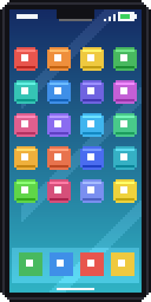

<div align="center">


# 📱 Life Essentials

**An iPhone in Minecraft — for real.** Control your actual Spotify or Apple Music, text other
players' phones, build playlists, and blast them out of a JBL speaker the whole server hears.

[](https://www.minecraft.net)
[](https://neoforged.net)
[](https://adoptium.net)
[](LICENSE)

</div>

---

## ✨ What it does

Craft an **iPhone** and right-click to switch it on. You hold it up **with both hands,
exactly like a filled map** — except it's a glowing phone screen (yes, it glows in caves).
Every phone activates itself with its own unique number, like `(238) 230-2939`.

<table>
<tr>
<td width="200" align="center"></td>
<td>

### 🎵 Music — your <em>real</em> Spotify & Apple Music
The phone remote-controls the actual desktop apps on your computer —
**macOS and Windows** — now playing, play/pause, skip, and a volume slider.

- **Volume ducking** — the louder your music, the quieter the game gets.
  Slide it up and creepers become elevator whispers. (Your saved sound
  settings are never touched.)
- **🔊 Speaker mode** — players within 24 blocks see note particles above
  your head and get a <em>"♪ Rafael ▶ Song — Artist"</em> notification.
- **🎧 Listen Along** — nearby players who also have Spotify automatically
  start playing the same track, so the whole group genuinely hears the music.
- **AirPods mode** — wearing AirPods? Switch output to private listening.

</td>
</tr>
<tr>
<td align="center"></td>
<td>

### 💬 Messages — text the phone, not the player
Open **Messages → New Message**, type a number, send. Whoever is carrying
that phone gets a chat ping (`[iPhone] (238) 230-2939 → you: hey`), a chime,
and the conversation in green/gray bubbles on their phone. Phones with
nobody online store messages server-side until they're opened again.

</td>
</tr>
<tr>
<td align="center"></td>
<td>

### 🎧 AirPods — cosmetic, visible, iconic
Right-click to put them in — **everyone sees the little white 3D buds** on
your ears. Right-click again to take them out. Drop them and they pop off
automatically (physics is undefeated).

</td>
</tr>
</table>

### 🔊 JBL Speaker — real audio, out loud, for everyone

A **placeable 3D block** modelled on the real Boombox — fabric-wrapped body,
a rubber carry handle over the top, big orange passive radiators on both ends
that light up while it's playing, and the control pad moulded into the shell.
Right-click it for the deck.

Load it with a playlist and **everybody in range genuinely hears the music**:
same song, same second, positioned in the world. Walk around it and it pans
between your ears; walk away and it fades out. The louder it is, the more the
game ducks under it.

| What you can queue | How it plays |
| :-- | :-- |
| **MP3 / FLAC / M4A / WAV / OGG / OPUS** | decoded and played from each listener's `lifeessentials-music` folder |
| **Direct http(s) links** | streamed straight off the web — nobody needs a local copy |
| **YouTube + YouTube Music links** | resolved and decoded in-process — nothing to install |
| **YouTube / YT Music playlists** | imports up to 100 tracks in one paste |
| **Spotify tracks** | handed to each listener's desktop Spotify (DRM can't be decoded — see the FAQ) |

Shuffle, three repeat modes, a volume slider, an 8–64 block range slider, and a
**redstone input** that works like tapping play/pause. Comparators read whether
it's playing.

### 📝 Playlists — the manager lives on your iPhone

Open **Playlists** on the phone: make a playlist, paste in links or tap files
out of your music folder, drag tracks up and down, delete what you don't want.
Playlists are **stored on the server**, so everyone sees the same ones and they
survive restarts. Tap any track to start the nearest speaker on it.

## 🛠 Crafting

| <br>**Circuit Board** | <br>**iPhone** | <br>**AirPods** | **JBL Speaker** |
| :---: | :---: | :---: | :---: |
| 🔴 🔴 🔴<br>🟡 ⬜ 🟡<br>🔴 🔴 🔴 | ⬜ ⬜ ⬜<br>⬜ ⬜ ⬜<br>⬜ 🟩 ⬜ | ⬜ ▪️ ⬜<br>⬜ 🟩 ⬜<br>▪️ ▪️ ▪️ | ⬛ ⬛ ⬛<br>🎵 🟩 🎵<br>⬜ ⬜ ⬜ |
| redstone • gold nugget • iron | iron ingots • circuit board | quartz • circuit board | black wool • note block • circuit board • iron |

<sub>🔴 redstone 🟡 gold nugget ⬜ iron/quartz 🟩 circuit board ⬛ black wool 🎵 note block ▪️ empty</sub>

## 📦 Install

1. Grab `life-essentials-x.y.z.jar` from [Releases](../../releases) (or build it — see below).
2. Drop it into your **NeoForge 1.21.1** modpack's `mods` folder. No other dependencies.
3. On servers: install it server-side too so texting and speaker broadcasts work.

> **macOS heads-up:** the first time you control Spotify/Music, macOS asks once —
> *"Minecraft wants to control Spotify"*. Click **OK** (it can hide behind the game window;
> fix later in System Settings → Privacy & Security → Automation).
>
> **Windows heads-up:** control goes through Windows' own media session system — no setup.
> If the phone says "Spotify not found", just open Spotify once so it can be detected.

### 🎚 Speaker setup

**None.** Since 2.0 the decoder is built into the mod — mp3, flac, m4a, opus, web
links and YouTube all play out of the box, with nothing to install.

Built-in decoding covers **macOS** (Intel and Apple Silicon), **64-bit Windows** and
**64-bit Linux** (Steam Deck included). On anything else — 32-bit, ARM Linux, Alpine —
the mod falls back to `ffmpeg`/`yt-dlp` if you have them, so you lose the convenience
but not the audio.

<sub>Versions before 2.0 needed `ffmpeg` on every listening machine, plus `yt-dlp` for
YouTube. That path is still there as an automatic fallback if the built-in decoder
can't start on your platform, but you shouldn't need it. Either way your **server**
never decodes anything — it only ever says which track and how far in.</sub>

Sharing a song from YouTube Music tacks a radio playlist onto the link; the mod
treats that as the one song you meant, not a hundred-track import. Paste a real
`/playlist?list=…` link when you do want the whole thing.

**Your music folder** is `<game dir>/lifeessentials-music/` — created on first
join, with a readme inside. Drop audio files in and they appear under
*Local files* in the phone's import screen. Playlists share only the **file
name**, so each player plays their own copy; anyone missing the file just hears
silence for that track. Use an http(s) link if you want everyone covered without
passing files around.

## 🧱 Building from source

```bash
export JAVA_HOME=/opt/homebrew/opt/openjdk@21/libexec/openjdk.jdk/Contents/Home
./gradlew build
```

Needs Java 21 (`brew install openjdk@21` on macOS). Homebrew's JDK is keg-only, so
Gradle can't start without `JAVA_HOME` exported. The jar lands in `build/libs/`.
See [ARCHITECTURE.md](ARCHITECTURE.md) for how the speaker's audio sync, decoder
pipeline and trust boundary actually work.
All textures are original pixel art generated by `python3 scripts/gen_textures.py` —
no Apple or Spotify assets are shipped.

## ❓ FAQ

**How does everyone hear the same thing without the server streaming audio?**
The server only ever sends *which track, and how far into it*. Every client in range decodes
its own copy locally and starts at that offset, so you all hear the same second of the same
song without a byte of audio crossing the network. The server resyncs every five seconds; a
client that drifts more than 2.5 s re-seeks itself.

**Why can't the speaker play Spotify audio directly?**
Spotify/Apple Music don't allow re-streaming audio to other people — technically or legally.
A Spotify track in a playlist does the honest version instead: the speaker tells everyone in
range *which* track, and each listener's own desktop Spotify plays it. Same song, same
moment, fully legit. Use mp3s or YouTube if you want the speaker itself making the sound.

**Does music control work on Windows/Linux?**
**Windows: yes** — via the System Media Transport Controls (AppleScript on macOS). Two
Windows-specific quirks: the slider ducks game audio but can't change Spotify's own volume
(Windows doesn't expose that per-app), and Windows broadcasters share the *song name* but
can't drive auto-play on listeners (no track ids in the media session API) — receiving
Listen Along from macOS players works fully. Linux isn't supported yet. The phone, texting,
and AirPods work everywhere.

**A YouTube track takes a few seconds to start.**
Normal — around three or four. YouTube signs its audio links with a cipher that has to be
worked out before anything can be fetched. Once playing, decoding runs hundreds of times
faster than realtime, so it never stutters after that. The speaker skips ahead by however
long the start-up took, which is what lands you in sync with everyone already listening.

If a track fails outright, the reason lands in your chat rather than leaving you with
silence and no explanation.

**Is the speaker safe on a public server?**
Track sources are validated server-side: file names can't escape the music folder, and only
`http`/`https` links are allowed through — no `file:` or other protocols. Do keep in mind
that a playlist *link* is a url your client will fetch, so treat a server's playlists the way
you'd treat any link someone sends you.

**Which loaders?**
NeoForge 1.21.1 (this repo). A legacy Fabric build exists but is unmaintained.

## 📄 License

[MIT](LICENSE) — do whatever, just keep the notice.

<div align="center">
<sub>Built with ❤️ and an unreasonable amount of AppleScript.</sub>
</div>
